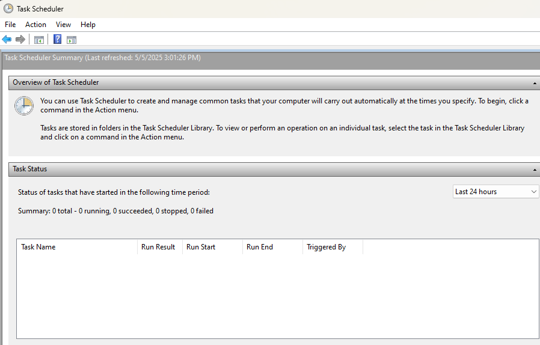

# Purpose

Automatic Deltek timecard filler, complete with a computer vision for reading RSA token values.

# Setup

## Hardware Needed

* A decent quality webcam (4k recommended) (I use [this camera](https://www.amazon.com/dp/B0CJHZ92P6))
* Something to hold both your webcam and RSA token in place (I use [this chemistry stand](https://www.amazon.com/dp/B0CF5NY4W4))

Plug your webcam in and make sure it has a good view of the token. If you're using Windows, the camera app will display the webcam's current view.

***IMPORTANT***: Make sure the token is well lit at the time you schedule it. Bad lighting is the most common cause of failure.

### Installation Steps

This section will assume you already have Python installed. If you don't, you can install it from [the official Python website.](https://www.python.org/downloads/)

#### 1. (Windows) Run initial setup script

Double click `setup.bat` to run. This script will create a Python virtual environment and install the necessary packages to run.

#### 2. Fill out the config

Open config-template.yaml as a text file and fill out the fields. Make sure all values are surrounded by quotes (").

Once you've filled everything out, rename the file to `config.yaml`.

#### 2. Schedule `run.bat` using Windows' Task Scheduler

A. Press the Windows key and type Task Scheduler. Open the first result and you should see an interface like this:

If you don't see this view, try clicking the "Up one level" button right below the toolbar.

B. Click Action -> Create task...

A new popup will open. Give the task an appropriate name, and decide whether you want the script to run even if you're logged off (recommend this option). Note: this does not require elevated privileges to run.

C. Define the trigger

Go to the Triggers tab and click "New...". Set it to begin "On a schedule", select "Weekly", and check each weekday.

If you want to make your timecard entries look a little more random, you can check "Delay task for up to". This will vary the actual time that the script executes.

D. Define the action

Go to the Actions tab and click "New...". 
* Define the action as "Start a program"
* In "Program/script" input the *entire* path to `run.b at` (example below)
* In "Start in" input the same path, minus `run.bat`

***Example:***\
If you cloned this repo to your desktop, the paths will look something like:
Program/script: `C:/Users/<you>/Desktop/Deltard/run.bat`
Start in: `C:/Users/<you>/Desktop/Deltard/`

E. Define Conditions (Optional, but recommended)

I recommend starting the task only if the computer has been idle for at least 10 minutes, and waking the computer to run the task. 
